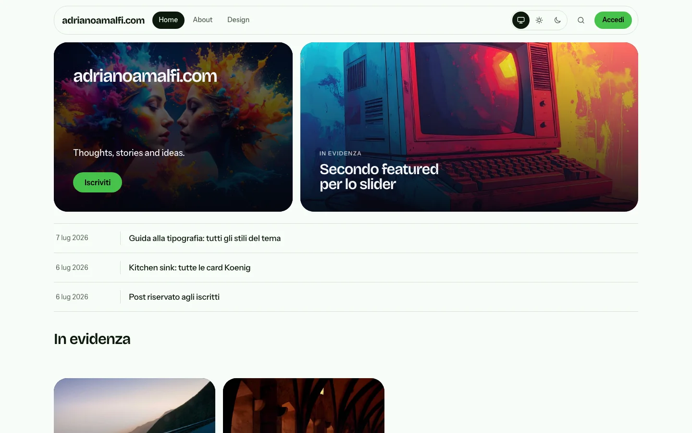
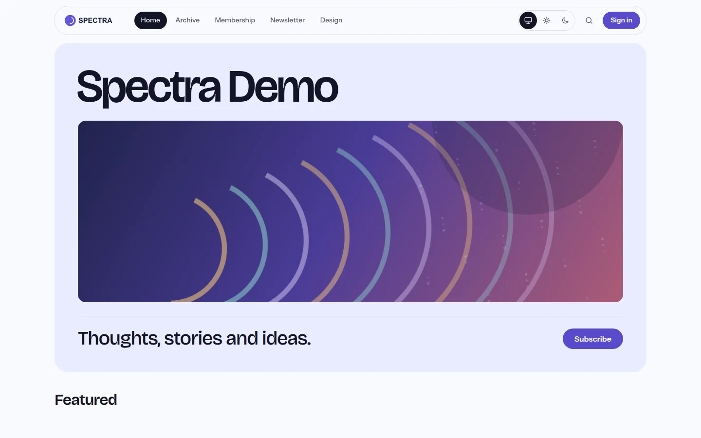
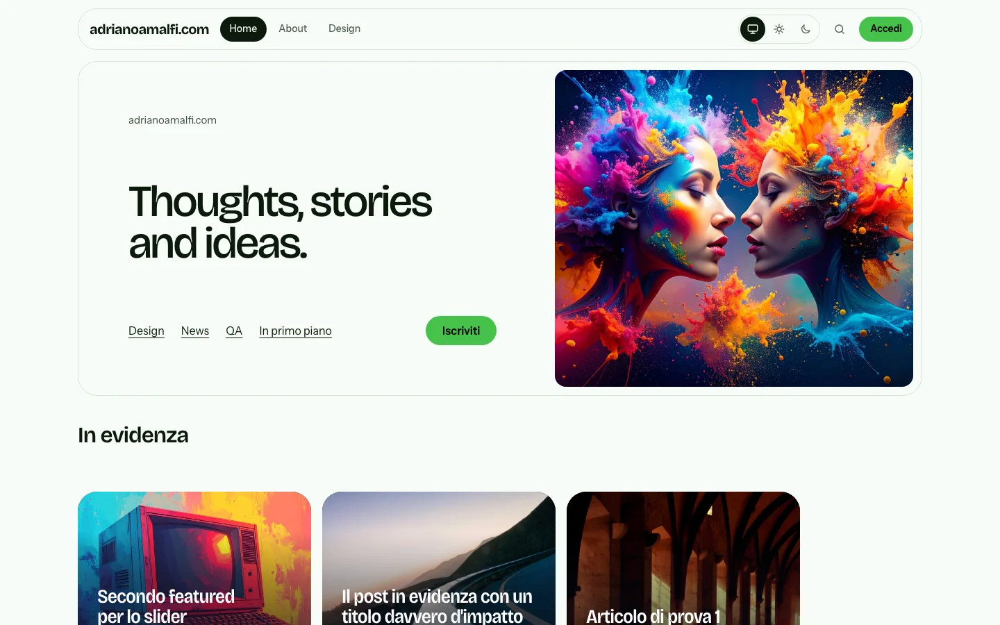
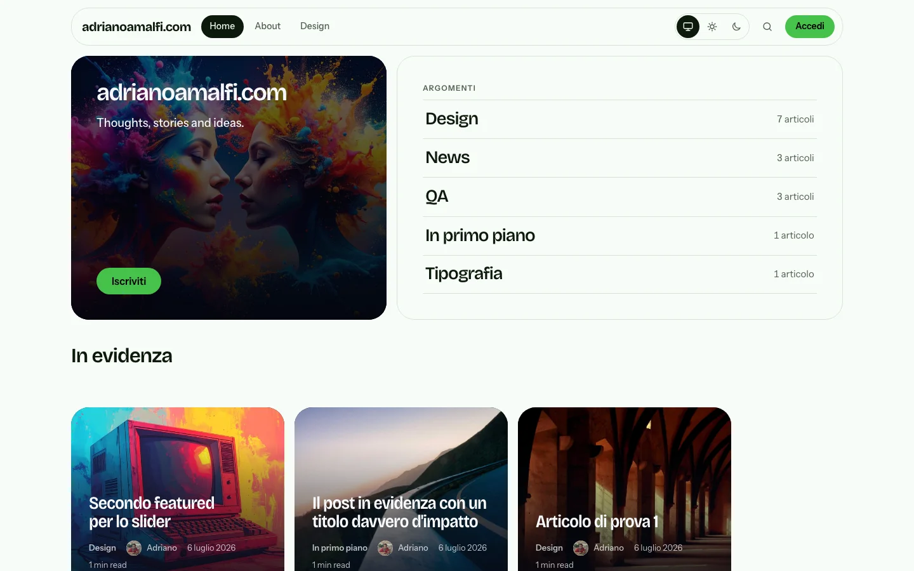
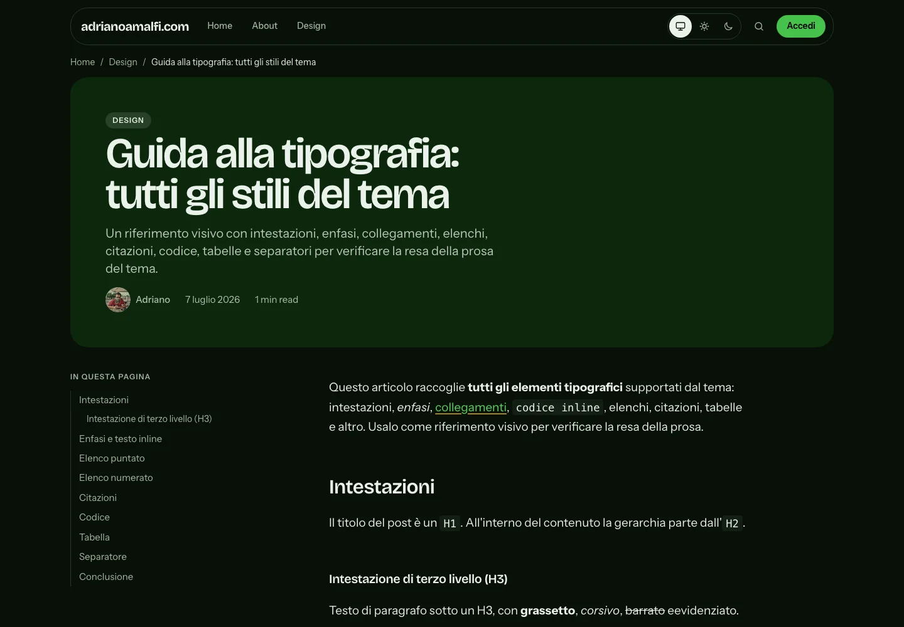
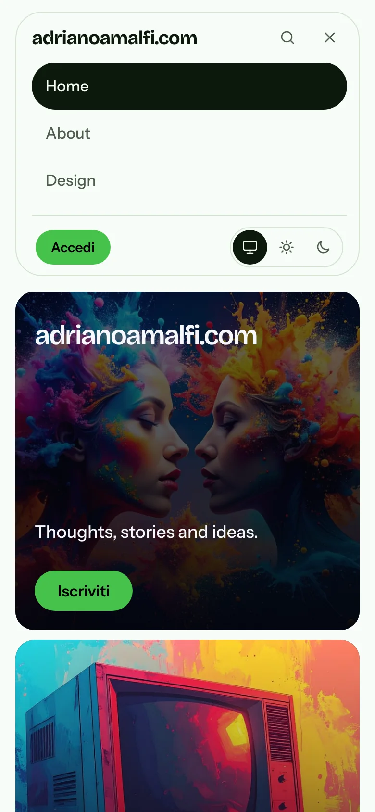
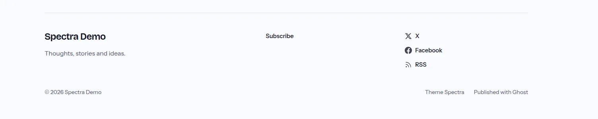

# Spectra

A modern, flexible and accessible [Ghost](https://ghost.org) theme for personal sites: a homepage, a place for writing, and pages in between. Plain CSS and a little progressive JavaScript, no build step, no framework.

Theme page: [adrianoamalfi.com/spectra](https://adrianoamalfi.com/spectra/) · Documentation: [adrianoamalfi.github.io/spectra-ghost](https://adrianoamalfi.github.io/spectra-ghost/)

[](https://github.com/adrianoamalfi/spectra-ghost/actions/workflows/ci.yml)
[](https://github.com/adrianoamalfi/spectra-ghost/releases)


| | |
| --- | --- |
| **Featured**: identity and the featured post; the latest-post list appears when the featured slider is off | **Masthead**: the name across the full width |
|  |  |
| **Statement**: your description is the headline | **Index**: your topics are the hero |
|  |  |

> **[Browse the full documentation and screenshots](https://adrianoamalfi.github.io/spectra-ghost/)**: every hero with and without a cover, light and dark, the reading experience, the page templates, the two footers and the phone layout.

| Article (dark) | Phone menu | Footer: Signoff |
| --- | --- | --- |
|  |  |  |

## Highlights

- **One colour in, a whole palette out.** Every surface, ink and tint is generated in OKLCH from the accent you set in Ghost Admin, for light and dark. Contrast stays at WCAG AA for any accent (see [DESIGN.md](DESIGN.md)).
- **Four hero styles**, all built from your real content and the publication cover: **Featured**, **Masthead**, **Statement**, **Index**.
- **Two footers**: **Colophon** (quiet columns) and **Signoff** (a closing tile with the subscribe call).
- **Bento feed** with tiles that adapt to their own width (container queries and a variable display font), plus Grid and List layouts, infinite scroll and an optional featured slider.
- **A calm reading experience**: table of contents with scroll-spy, share row, previous and next post, breadcrumbs with structured data, reading progress, heading anchors, code copy buttons, an image lightbox and lazy-loaded comments.
- **Colour scheme switch** (system, light, dark) in the header, applied before first paint so there is no flash.
- **Membership ready**: subscribe section, a call to action for gated posts, a membership page with your tiers, a newsletter archive, donations button and Ghost recommendations.
- **Page templates**: Landing, Archive, Membership, Newsletter.
- **Seven languages**: English, Italian, German, Spanish, French, Portuguese and Dutch.
- **Smooth navigation**: cross-document View Transitions morph a tile into the article header.

## Requirements

- Ghost 6.0 or newer (tested with Ghost 6.69).
- A current browser. The theme uses relative colour syntax, `light-dark()`, container queries and `:has()`: Chrome and Edge 123+, Safari 17.5+, Firefox 128+. View Transitions and scroll-driven animations are progressive: where unsupported, the pages simply do not animate.

## Install

1. Get `spectra.zip` from the [Releases](https://github.com/adrianoamalfi/spectra-ghost/releases) page, or build it yourself with `npm run zip`.
2. In Ghost Admin open **Settings, Design & branding, Change theme, Upload theme**.
3. Activate it, then open **Design** to choose the hero, footer and feed styles.

## Settings

Ghost Admin, Design & branding, Site-wide and Homepage / Post groups.

<!-- settings:start -->

### General

| Key | Setting | Values | Notes |
| --- | --- | --- | --- |
| `color_scheme` | Colour scheme | Auto / Light / Dark (default: Auto) | Auto follows the visitor's system preference |
| `header_style` | Header layout | Inline / Stacked (default: Inline) | Inline: brand and menu on one row. Stacked: brand centered above the menu |
| `footer_text` | Footer line | Text | Optional line shown in the footer. Falls back to the site description |
| `footer_style` | Footer style | Colophon / Signoff (default: Colophon) | Colophon: quiet, ruled columns. Signoff: closing tile with subscribe |
| `secondary_accent` | Secondary accent | Colour (default: #f5b301) | Text selection and link underline highlights |

### Homepage

| Key | Setting | Values | Notes |
| --- | --- | --- | --- |
| `show_hero` | Show hero | On / Off (default: on) |  |
| `hero_style` | Hero style | Featured / Masthead / Statement / Index (default: Featured) | Layout of the homepage hero |
| `hero_eyebrow` | Hero greeting | Text | Small line above the title, e.g. "Hello, I'm" |
| `post_feed_style` | Feed layout | Bento / Grid / List (default: Bento) | Bento: mixed-size tiles. Grid: uniform tiles. List: one per row |
| `show_featured_slider` | Featured slider | On / Off (default: off) | Show the other featured posts as a swipeable row under the hero |
| `personal_hero_headline` | Statement headline | Text | Statement hero: headline (defaults to the site description) |
| `personal_hero_text` | Statement line | Text | Statement hero: short line under the headline |
| `cta_headline` | Subscribe headline | Text | Subscribe section: headline |
| `cta_text` | Subscribe line | Text | Subscribe section: supporting line |

### Post

| Key | Setting | Values | Notes |
| --- | --- | --- | --- |
| `show_reading_time` | Reading time | On / Off (default: on) |  |
| `show_author_meta` | Author on posts and cards | Name and photo / Name only / Hidden (default: Name and photo) | Author on posts and cards |
| `show_toc` | Table of contents | On / Off (default: on) | Table of contents on long posts |
| `show_reading_progress` | Reading progress bar | On / Off (default: on) | Reading progress bar at the top of posts |
| `show_related_posts` | Related posts | On / Off (default: on) |  |

<!-- settings:end -->

The **accent colour** is Ghost's own (Design, Brand). Spectra derives everything else from it. The **publication cover** (Settings, General) is the hero image; without it the heroes render their image-free version.

Visitors can override the colour scheme with the switch in the header. Their choice is saved in their browser and wins over `color_scheme`.
The header logo is shown as uploaded in Light mode and rendered monochrome white in Dark mode; Auto follows the visitor's system preference.

## Homepage

| Hero style | What it shows |
| --- | --- |
| **Featured** | Your identity next to the featured post (the latest post if none is featured). With the slider off, the hero also shows the latest posts as a ruled list; with it on, and when other featured posts exist, they appear in the slider instead. |
| **Masthead** | The site name across the full width, a hairline, then description and subscribe. With a cover, a panoramic strip appears. |
| **Statement** | The site description (or `personal_hero_headline`) is the headline, with your top topics as links. With a cover the tile splits in two. |
| **Index** | Your topics and their real post counts are the hero. With a cover the identity sits on the image. |

On the first page the feed skips posts that the hero list or the featured slider already show. The subscribe section at the bottom appears when members are enabled and the footer is not the Signoff style (which already carries it).

## Page templates

Pick them in the page settings (Template). Each page keeps its title and content from the editor.

| Template | Use it for |
| --- | --- |
| *Default* | A normal page. |
| **Landing** | A page built entirely from editor cards, with no title or chrome. |
| **Archive** | The page content, every public topic with its post count, then all posts (grouped by year when JavaScript is available). |
| **Membership** | The page content, then your paid tiers with monthly and annual Portal sign-up options where available, then the subscribe form. |
| **Newsletter** | The page content, a subscribe form, then past editions. Tag your sent newsletters with the internal tag `#newsletter`; they list here without appearing as a public tag. |

## Posts

- **Table of contents** appears on the left of long posts (two or more headings). On small screens it is a collapsed disclosure.
- **Gated posts** show a single call to action in place of Ghost's default one, worded for free or paid access.
- **Related posts** come from the primary tag, falling back to the latest posts.
- **Comments** load only when the reader scrolls near them, keeping that script off the first load.
- The **share row** offers X, Facebook and a copy-link button: the same accounts Ghost has in Settings, General, Social accounts. With donations enabled it also carries a *Support this site* button.

## Footer and social links

Both footers use your **secondary navigation**, the **X and Facebook accounts** set in Ghost Admin, RSS, **Ghost recommendations** when you have them, and the donations button when donations are on. The footer line comes from `footer_text`, falling back to the site description.

## Languages

Spectra reads Ghost's site language. Included: `en`, `it`, `de`, `es`, `fr`, `pt`, `nl`. To add one, copy `locales/en.json`, translate the values (keep `{placeholders}` and `%`) and run `npm run check:i18n`.

## Accessibility and performance

- Colour contrast is generated, not hoped for: ink and fills are chosen from the accent's lightness. The check ran over a wide range of accents, in both schemes.
- Everything works without JavaScript except the enhancements listed above; the scheme switch is hidden without it.
- Motion is limited to short transitions and respects `prefers-reduced-motion`.
- Fonts are self-hosted variable files (about 190 KB in total), with `font-display: swap`.
- The templates are checked by `npm run check`; rendered pages should be checked with an engine such as axe-core when you change the CSS.

## Development

For contribution guidelines, pull request checks, and release steps, see [CONTRIBUTING.md](CONTRIBUTING.md).

```bash
npm ci
npm run check        # gscan + translations + static accessibility checks
npm run zip          # spectra.zip, ready to upload; no system zip command needed
npm run docs         # regenerate the settings tables in the README and the docs site
```

To work on the theme locally, link the folder into a Ghost install and restart Ghost:

```bash
ln -s "$PWD" /path/to/ghost/content/themes/spectra
```

### Documentation site

`docs/` is a static site published with GitHub Pages (Settings, Pages, branch `main`, folder `/docs`). The settings tables are generated by `npm run docs`; CI fails if they are out of date. The screenshots come from `scripts/screenshots.mjs`, which drives a local Chrome through the DevTools protocol against a running Ghost (see the header of that file for the groups and options).

Pull requests run the CI workflow, which also validates the installable theme ZIP. Pushing a `vX.Y.Z` tag matching the package version runs the Release workflow and publishes `spectra.zip` to GitHub Releases. See [CONTRIBUTING.md](CONTRIBUTING.md) for the release steps and the `main` branch protection settings maintainers should enable.

Changes to CSS and JavaScript show after a reload; changes to templates or to `package.json` settings need a Ghost restart.

`routes.example.yaml` shows how to put the blog under `/writing/` while keeping a custom home.

### Structure

| Path | Purpose |
| --- | --- |
| `default.hbs` | Base layout: head, scheme script, header, footer, scripts |
| `home.hbs`, `index.hbs` | Home (hero, featured slider, feed, subscribe) and the paginated list |
| `post.hbs`, `page.hbs` | Post and page |
| `custom-*.hbs` | Page templates: Landing, Archive, Membership, Newsletter |
| `tag.hbs`, `author.hbs` | Archives |
| `error.hbs`, `error-404.hbs` | Errors |
| `partials/hero-*.hbs` | The four heroes and their shared pieces |
| `partials/footer-*.hbs` | The two footers |
| `partials/icons/` | Inline SVG icons (only X, Facebook, RSS for social) |
| `assets/css/screen.css` | Tokens, base, layout, components, Koenig cards, motion, print |
| `assets/js/main.js` | Site-wide: menu, scheme switch, infinite scroll, archive, title fitting |
| `assets/js/post.js` | Posts and pages: contents, anchors, code copy, lightbox, comments |
| `locales/` | Translations |
| `scripts/` | `check-i18n.js`, `check-a11y.js`, `docs-settings.mjs`, `package-theme.mjs`, `screenshots.mjs` |
| `docs/` | The documentation site (GitHub Pages) and its screenshots |

## Credits and licence

Designed and built by [Adriano Amalfi](https://adrianoamalfi.com). Fonts: [Bricolage Grotesque](https://github.com/ateliertriay/bricolage) and [Instrument Sans](https://github.com/Instrument/instrument-sans), both under the SIL Open Font License.

Released under the [MIT licence](LICENSE).
